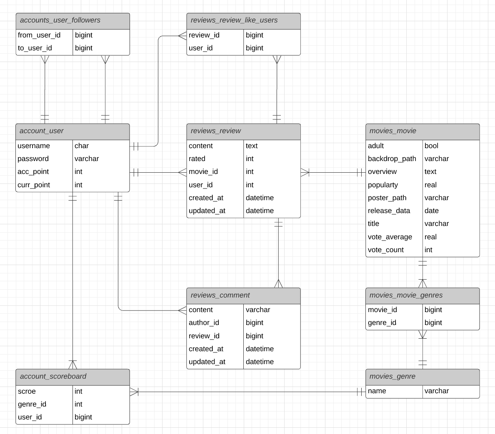
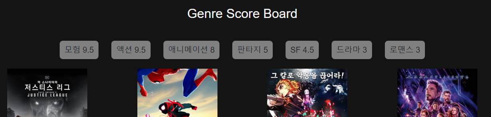
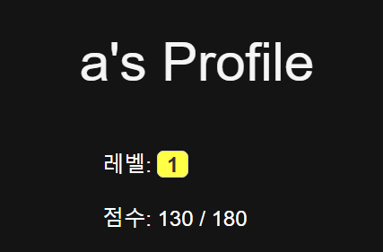

# 6-Dragon-Cinema

**육룡이시네마(6-Dragon-Cinema)는 영화를 좋아한다면 누구나 영화평론가가 될수 있는 웹사이트 입니다.**

> https://6-dragon-cinema.netlify.app/

- **Community**: 다른 사람의 리뷰를 좋아요 할 수 있고 그 사람을 팔라우 할 수도 있습니다. 또한 팔로우한 사람들의 리뷰 목록들을 모아서 볼 수있도록 제공합니다.
- **Recommend**: 자신이 작성한 리뷰, 별점들을 바탕으로 맟춤 영화들을 추천해 줍니다.
- **Shop**: 리뷰를 작성할 때 영화에 별점을 매기게 되고 이 후 다른 유저가 같은 별점으로 리뷰를 작성하게 되면 자신의 포인트가 올라갑니다. 이 포인트를 이용해 다양한 영화 굿즈들을 구매할 수 있습니다.

## 데이터 베이스



- 개체로는 유저(`accounts_user`), 영화(`movies_movie`), 장르(`movies_genre`)가 있다.
- `accounts_user_followers`: 유저는 유저를 following 할 수 있다. (M:N)
- `reviews_review`: 유저는 영화에 대해 리뷰를 작성할 수 있다. (M:N)
- `reviews_comment`: 유저는 리뷰에 대해 댓글을 작성할 수 있다. (M:N)
- `reviews_review_like_users`: 유저는 리뷰를 좋아요 할 수 있다. (M:N)
- `movies_movie_genres`: 영화는 여러개의 장르를 가진다. (M:N)
- `account_scoreboard`: 유저가 영화에 리뷰를 작성할 때마다 해당 영화의 장르들에 점수가 추가된다. (M:N)


## 주요 기능 설명

### 1. Community

#### 1.1. 유저는 유저를 following 할 수 있다.

- accounts/views.py
```python
  # ...
  @api_view(['POST'])
  def follow(request, user_id):
      me = request.user
      you = get_object_or_404(User, pk=user_id)
      if me != you:
          if you.followers.filter(pk=me.pk).exists():
              you.followers.remove(me)
          else:
              you.followers.add(me)
          return Response({ 'id': you.id }, status=status.HTTP_204_NO_CONTENT)
      return Response({'detail': '권한이 없습니다.'}, status=status.HTTP_403_FORBIDDON)
  # ...
```

#### 1.2  following한 유저들의 리뷰목록들을 최신순으로 모아 볼 수 있다.

- reviews/views.py
```python
  # ...
  @api_view(['GET'])
  def community(request):
      user = get_object_or_404(User, pk=request.user.pk)
      people = user.followings.all()
      tmp = []
      for person in people:
          reviews = person.review_set.all()
          serializer = ReviewSerializer(reviews, many=True)
          tmp += serializer.data
      result = sorted(tmp, key=lambda item: item['created_at'], reverse=True)
      return Response(result)
  # ...
```


### 2. Recommend


#### 2.1. 각 유저는 개인 장르 점수판을 가진다.
- accounts/models.py
```python
  # ...
  class Scoreboard(models.Model):
      user = models.ForeignKey(settings.AUTH_USER_MODEL, on_delete=models.CASCADE)
      genre = models.ForeignKey(Genre, on_delete=models.CASCADE)
      score = models.IntegerField()
```

- reviews/views.py
```python
  @api_view(['GET'])
  def recommend(request):
      user = get_object_or_404(User, pk=request.user.pk)
      board = {}
      scores = user.scoreboard_set.all()
      for score in scores:
          if board.get(score.genre.id):
              board[score.genre.id]['score'] += score.score
          else:
              board[score.genre.id] = {
                  'genre_id': score.genre.id,
                  'genre_name': score.genre.name,
                  'score': score.score,
              }
              
       # ...
```
- 유저 정보를 기반으로 `Scoreboard`에 작성된 모든 장르별 점수들을 취합하여 반환한다.

#### 2.2. 유저가 영화에 리뷰를 작성할 때마다 해당 영화의 장르들에 점수가 추가된다.
- reviews/views.py
```python
# ...
@api_view(['GET', 'POST'])
def get_create_by_movie(request, movie_id):
    if request.method == 'POST':
        movie = get_object_or_404(Movie, pk=movie_id)
        # ...
            score_data = {
                'score': request.data.get('rated')
            }
            genres = movie.genres.all()
            for genre in genres:
                score_serializer = ScoreboardSerializer(data=score_data)
                if score_serializer.is_valid(raise_exception=True):
                    score_serializer.save(user=request.user, genre=genre)
        sorted_board = sorted(board.values(), key=lambda item: item['score'], reverse=True)
        # ...
# ...
```

#### 2.3. 장르 점수판을 기반으로 영화를 추천해 준다.
-  reviews/views.py
```python
@api_view(['GET'])
def recommend(request):
    user = get_object_or_404(User, pk=request.user.pk)
    # ...
    movies = []
    for item in sorted_board:
        genre = get_object_or_404(Genre, pk=item['genre_id'])
        for movie in genre.movie_set.order_by('-vote_average')[:5]:
            if movie in movies: continue
            movies.append(movie)
    serializer = MovieListSerializer(movies, many=True)
    result = []
    result.append(sorted_board)
    result.append(serializer.data)
    return Response(result)
```
-  가장 점수가 높은 장르부터 평점이 높은 영화 5개씩 모아서 함께 반환한다.

### 3. Shop
#### 3.1. 리뷰를 작성할 때 영화에 별점을 매기게 되고 이 후 다른 유저가 같은 별점으로 리뷰를 작성하게 되면 자신의 포인트가 올라갑니다.



-  accounts/models.py
```python
class User(AbstractUser):
    followings = models.ManyToManyField('self', symmetrical=False, related_name='followers')
    acc_point = models.IntegerField(default=0)
    curr_point = models.IntegerField(default=0)
```
-  reviews/views.py
```python
@api_view(['GET', 'POST'])
def get_create_by_movie(request, movie_id):
    if request.method == 'POST':
        # ...
        target_reviews = Review.objects.filter(movie_id=movie_id, rated=request.data.get('rated'))
        for review in target_reviews:
            user = get_object_or_404(User, pk=review.user_id)
            user.acc_point += 10
            user.curr_point += 10
            user.save()
        # ...
```
-  `target_reviews`: 현재 작성된 리뷰들중에 같은 영화, 같은 별점을 기준으로 검색된 리뷰들
-  이 후 `target_reviews`를 순회하면서 해당 리뷰를 작성한 유저들에게 포인트를 올려준다.
-  추후 포인트를 이용해 영화 굿즈등 상품을 구매할 수 있는 시스템을 만들 계획


## 느낀점

가장 많은 시간이 들고 어려웠던 부분은 데이터베이스 모델링이였다. 

실제 세상에서 일어나는 일들(회원가입을 하고 리뷰를 작성하고 등등)을 데이터의 관점에서 바라 보아야 한다는 것이 처음에는 낯설고 직관적이지 않았다.

하지만 논리적으로 하나하나씩 따져가면서 데이터베이스를 설계해가면서 많은 흥미를 느꼈다. 이번 프로젝트는 비교적 작은 프로젝트여서 앞으로 더 크고 여러가지의 상황들을 모델링을 해보고 싶다는 생각을 했다.

